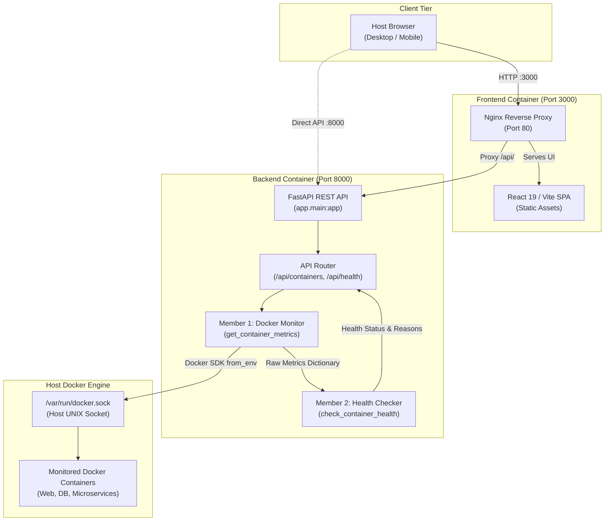

# ContainerCare – Docker Container Health Monitor

[](https://github.com/RajeshwariHaridass/ContainerCare/actions/workflows/ci.yml)


A lightweight, automated Docker container monitoring and health evaluation dashboard designed for DevOps workflows. ContainerCare connects directly to the local Docker Engine, extracts real-time CPU, memory, status, and restart telemetry, classifies container health through threshold-based heuristics, and presents actionable operational insights through a modern web interface.

---

## 1. Problem Statement

In containerized microservice architectures and local development environments, tracking container states typically relies on manual execution of command-line utilities such as `docker ps` and `docker stats`. This manual approach presents significant operational challenges:

- **Delayed Incident Visibility**: Containers that crash, exit unexpectedly, or become trapped in restart loops often go unnoticed until downstream applications fail.
- **Resource Saturation**: Gradual memory leaks and high CPU spikes can degrade host performance without immediate alerting.
- **Cognitive Overhead**: Correlating raw percentage metrics against acceptable operational limits across multiple services is tedious and prone to human error.

---

## 2. Solution

**ContainerCare** provides an automated, centralized observability dashboard that continuously monitors Docker containers without requiring complex external agents:

1. **Automated container discovery and live telemetry collection** across all running and stopped containers on the host Docker Engine.
2. Collects non-streaming point snapshots of CPU utilization and memory usage.
3. Evaluates telemetry against standardized operational thresholds.
4. Categorizes every container into one of four distinct health states: **HEALTHY**, **WARNING**, **CRITICAL**, or **FAILED**.
5. Surfaces specific root-cause reasons (e.g., high memory consumption or repeated restarts) to accelerate troubleshooting.

---

## 3. Key Features

- **Live container telemetry with auto-refresh**: Automatic discovery of container ID, name, status, CPU %, memory %, and restart count.
- **Threshold-Driven Health Classification**: Classifies containers into `HEALTHY`, `WARNING`, `CRITICAL`, and `FAILED` states.
- **Granular Issue Reporting**: Provides human-readable alert reasons for degraded containers (e.g., *"High CPU usage"*, *"Multiple container restarts"*).
- **Interactive Web Dashboard**:
  - KPI summary cards displaying dynamic counts of healthy, warning, critical, and failed containers.
  - Container table with status pills, visual resource gauge bars, and alert badges.
  - Search filter by container name or container ID.
  - Filter tabs by health classification.
  - Container inspection modal for detailed diagnostic analysis.
- **Resilient Connection Handling**: Auto-refreshing polling with in-flight request guards and graceful offline banners when Docker Desktop is unavailable.
- **Full Containerization**: Entire stack runnable with a single command via Docker Compose.
- **Automated CI Validation**: GitHub Actions workflow validating unit tests and multi-container Docker builds on every pull request.

---

## 4. System Architecture

The project follows a decoupled three-tier architecture:



### Docker Compose Architecture
- **`backend` service**: Runs Python 3.11 with FastAPI and Uvicorn. Mounts the host Docker Engine socket (`/var/run/docker.sock:ro`) in read-only mode, enabling the Docker Python SDK to inspect host containers without modification privileges.
- **`frontend` service**: Multi-stage build (Node 20 build -> Nginx Alpine runtime) exposing the web interface on host port `3000` and reverse proxying `/api/` calls directly to `backend:8000`.
- **`containercare-net`**: Isolated bridge network enabling seamless inter-container communication.

---

## 5. Health Detection Rules & Thresholds

Health classification is executed by the rule-based evaluation engine in `backend/app/health/`:

### Configurable Thresholds (`HealthThresholds`)
| Telemetry Metric | Warning Level (Inclusive) | Critical Level (Threshold) |
| :--- | :--- | :--- |
| **CPU Usage** | $\ge 70.0\%$ | $> 85.0\%$ |
| **Memory Usage** | $\ge 70.0\%$ | $> 85.0\%$ |
| **Restart Count** | $\ge 1$ | $\ge 3$ |

### Classification Hierarchy
1. **`FAILED`**: Assigned immediately if the container execution status is **not** `'running'` (e.g., `'exited'`, `'stopped'`, `'paused'`, or `'dead'`). CPU and memory checks are bypassed.
2. **`CRITICAL`**: Container is running, and at least one metric meets critical criteria:
   - CPU $> 85.0\%$, OR
   - Memory $> 85.0\%$, OR
   - Restarts $\ge 3$.
3. **`WARNING`**: Container is running, with no critical metrics, but at least one warning criterion is triggered:
   - CPU $\ge 70.0\%$, OR
   - Memory $\ge 70.0\%$, OR
   - Restarts $\ge 1$.
4. **`HEALTHY`**: Container is running with all metrics operating within normal baseline limits (CPU $< 70\%$, Memory $< 70\%$, Restarts $= 0$).

---

## 6. Technology Stack

- **Backend Application**:
  - Python 3.11
  - FastAPI (REST API framework)
  - Uvicorn (ASGI web server)
  - Pydantic v2 (Data validation and response schemas)
  - Docker Python SDK (`docker>=7.0.0`)
- **Frontend Dashboard**:
  - React 19
  - Vite (Build tooling and dev server)
  - Vanilla CSS (Custom dark navy DevOps design system)
  - Nginx Alpine (Production web server and reverse proxy)
- **DevOps & Infrastructure**:
  - Docker (Containerization)
  - Docker Compose v2 (Multi-container orchestration)
  - GitHub Actions (Continuous Integration)

---

## 7. Project Structure

```
containercare/
├── .github/
│   └── workflows/
│       └── ci.yml                 # GitHub Actions CI validation workflow
├── backend/
│   ├── Dockerfile                 # Backend container image definition
│   ├── app/
│   │   ├── __init__.py
│   │   ├── main.py                # FastAPI app entry point & CORS configuration
│   │   ├── api/                   # REST API routes and Pydantic schemas
│   │   ├── docker_monitor/        # Member 1: Docker connection & metrics collection
│   │   └── health/                # Member 2: Thresholds & health evaluation rules
│   └── tests/                     # 31 Unit and integration tests
├── frontend/
│   ├── Dockerfile                 # Production multi-stage Docker build
│   ├── nginx.conf                 # Nginx reverse proxy configuration
│   ├── package.json               # Frontend dependencies and build scripts
│   ├── vite.config.js             # Vite dev server and proxy configuration
│   └── src/
│       ├── components/            # Modular dashboard UI components
│       ├── services/api.js        # Centralized API client
│       ├── App.jsx                # Main application component
│       └── index.css              # Dark navy DevOps stylesheet
├── docker-compose.yml             # Complete multi-service compose specification
├── requirements.txt               # Backend Python dependencies
└── README.md                      # Project documentation
```

---

## 8. Local Development Setup

### Prerequisites
- Python 3.11+
- Node.js 18+ and npm
- Docker Desktop running on the host system

### Running Backend Locally
```powershell
cd containercare
pip install -r requirements.txt
python -m uvicorn app.main:app --app-dir backend --host 127.0.0.1 --port 8000 --reload
```
API Documentation will be available at: `http://127.0.0.1:8000/docs`

### Running Frontend Locally
```powershell
cd containercare/frontend
npm install
npm run dev
```
Dashboard will be available at: `http://127.0.0.1:5173/`

---

## 9. Docker Deployment

To launch the complete ContainerCare stack in isolated production containers:

```powershell
cd containercare
docker compose up --build -d
```

### Accessing Services
- **Web Dashboard**: `http://localhost:3000`
- **Backend API**: `http://localhost:8000`
- **Interactive API Documentation**: `http://localhost:8000/docs`

### Stopping the Stack
```powershell
docker compose down
```

---

## 10. Continuous Integration (CI)

ContainerCare uses **GitHub Actions** for automated build and test validation on every `push` and `pull_request` targeting the `main` branch ([.github/workflows/ci.yml](.github/workflows/ci.yml)).

```
Code Push / Pull Request (main)
   │
   ├── 1. Checkout repository code
   ├── 2. Set up Python 3.11 with pip cache
   ├── 3. Install dependencies (requirements.txt)
   ├── 4. Run 31 backend unit tests (unittest discover)
   ├── 5. Set up Docker Buildx
   ├── 6. Validate Docker Compose config (docker compose config)
   └── 7. Build backend and frontend images (docker compose build)
```

The pipeline enforces quality gates: any test failure, invalid Compose configuration, or Docker build error will immediately halt the workflow.

---

## 11. Failure & Recovery Demonstration

The platform dynamically detects container lifecycle transitions in real time:

1. **Failure State Simulation**:
   ```powershell
   docker stop <container_id_or_name>
   ```
   Within the next polling cycle, the dashboard updates the container's status badge to `FAILED`, tags the Docker status as `exited`, sets CPU/memory to `0.0%`, and displays the alert reason:
   ```json
   {
     "status": "exited",
     "health": "FAILED",
     "reasons": ["Container is not running (status: exited)"]
   }
   ```

2. **Recovery State Simulation**:
   ```powershell
   docker start <container_id_or_name>
   ```
   Upon restart, the engine inspects the restored process, measures active CPU and memory utilization, resets the alert reasons, and restores the container status badge to `HEALTHY`.

---

## 12. Testing

The backend includes a comprehensive unit and integration test suite using Python's `unittest` framework:

```powershell
cd containercare
python -m unittest discover -s backend/tests -v
```

### Test Suite Summary:
- **Member 1 Tests (`test_docker_monitor.py`)**: 18 tests covering Docker connection handling, container attribute parsing, CPU percentage calculations with zero/nonzero deltas, memory percentage calculations, and stopped container handling.
- **Member 2 Tests (`test_health.py`)**: 7 tests verifying classification of Healthy, Warning, Critical, and Failed containers, custom thresholds, and multi-issue aggregation.
- **API Tests (`test_api.py`)**: 6 tests verifying root information endpoints, `/api/health`, `/api/containers`, 503 error handling during daemon downtime, and CORS headers.
- **Status**: **31 / 31 tests currently passing.**

---

## 13. Limitations

To maintain architectural transparency:
- **Snapshot-Based Telemetry**: Metrics reflect point-in-time snapshots captured during polling. The system does not stream continuous data via WebSockets.
- **No Historical Time-Series Storage**: ContainerCare does not maintain a time-series database (e.g., Prometheus or InfluxDB); historical trend graphs across days or weeks are not supported.
- **Rule-Based Heuristics**: Failure detection relies strictly on defined thresholds rather than predictive machine learning or anomaly detection algorithms.
- **Single-Host Daemon Scope**: Designed for single-node Docker Engine installations rather than distributed clusters or Kubernetes environments.

---

## 14. Future Enhancements

Potential extensions for future iterations include:
- **Historical Metrics Visualization**: Integrating SQLite or Prometheus for multi-hour metric trendlines.
- **Alert Notifications**: Dispatching webhook alerts to Slack, Discord, or email upon detection of `CRITICAL` or `FAILED` containers.
- **Dynamic Threshold Configuration**: Exposing frontend settings to adjust warning and critical threshold values dynamically at runtime.
- **Multi-Host Management**: Supporting remote Docker Engine daemon connections over TLS.

---

## 15. Team Contributions

- **Member 1 — Docker Monitoring & Data Collection**:
  - Implemented Docker client connection management via official Docker SDK.
  - Implemented container discovery and metadata extraction (`id`, `name`, `status`, `restarts`).
  - Implemented CPU % and memory % usage calculation formulas.
  - Authored unit test coverage for monitoring components.
- **Member 2 — Health Checking & Failure Detection**:
  - Defined configurable warning and critical threshold data structures.
  - Implemented failure detector for stopped containers, excessive resource usage, and restart loops.
  - Developed overall health classification engine (`HEALTHY`, `WARNING`, `CRITICAL`, `FAILED`).
  - Authored health evaluation unit test suite.
- **Member 3 — API Layer, Frontend Dashboard & DevOps Orchestration**:
  - Developed FastAPI REST API endpoints (`/api/containers`, `/api/health`) and Pydantic schemas.
  - Built responsive React 19 monitoring dashboard with search, status filtering, and diagnostic inspection modal.
  - Configured Nginx reverse proxy and multi-stage container builds.
  - Orchestrated multi-service stack with Docker Compose and implemented GitHub Actions CI workflow.

---

## 16. License

This project was developed as an academic DevOps mini-project. An open-source license (such as MIT or Apache 2.0) may be formally assigned at a later stage.
